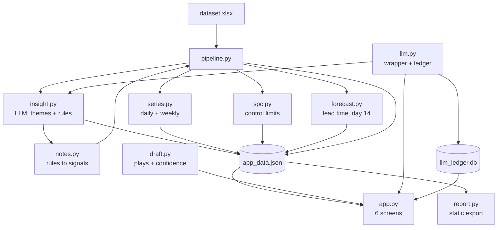
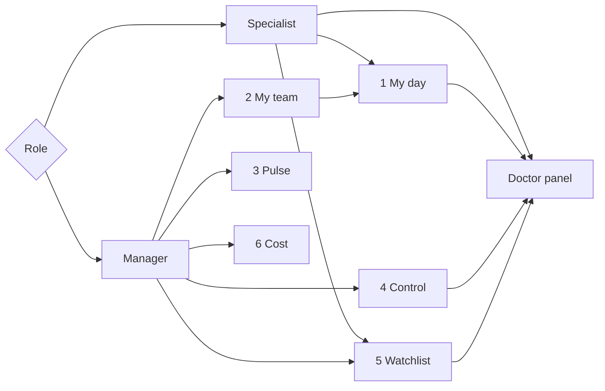
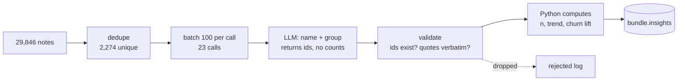

# CS Control Room — Implementation Plan

Sep 29, 2026 · @Miguel Garcia

## What we are building

One application, two audiences, six screens, one data bundle. A specialist opens it on Tuesday and works their portfolio without opening anything else. A manager opens it on Monday, sees what moved, and can tell signal from noise because the chart says so rather than because they squinted. Nothing is a file you have to find.

The static reports stay — they are the thing a manager forwards — but they become an export from the app, not a separate artifact you regenerate by hand.

**The gate. This is done when all five hold:**

1. A specialist can go from opening the app to a sendable draft in under 30 seconds, without typing a doctor's name.
2. A manager can answer *"is this week's drop real or noise?"* from the screen, with no analyst.
3. Every number on every screen comes from one build, so two screens can never disagree.
4. Every alert names the rule that fired it and the doctor it fired on. No unexplained red.
5. It runs from one command and rebuilds from one command.

**What is genuinely new here, beyond making the existing work clickable:**

- A **pulse** view of daily movement — built only on the four series that actually have daily volume.
- **Control charts** with real limits, so the operation stops reacting to every wobble.
- A **predictive layer** with measured lead time: the warning signals in this data arrive a median of **18 to 46 days before the cancellation**, 100% of the time. That is the whole basis for going from reactive to predictive, and it is measured, not asserted.

## Architecture

The rule that keeps this honest: **one build, one bundle, every surface reads it.** No screen computes anything. If the manager view says 88 doctors may cancel, the specialist queue contains those 88 — not because the two agree, but because there is only one place the number can come from.



**What is reused unchanged** — this is most of it, and it is why this is a two-week build and not a two-month one:

| Already runs | Role in the app |
| --- | --- |
| `pipeline.py` | Still the only code that opens the workbook. Gains one job: emit the bundle |
| `notes.py` | The 23 note signals. Feeds the predictive layer directly |
| `draft.py` | The eight plays, the three modes, the confidence model. The specialist screen is a UI over it |
| `charts.py` | Inline SVG bars, colors already validated light and dark |
| `report.py` | Becomes an export button rather than a separate script |
| `analysis.py` | Unchanged. Still the thing that proves any number on any screen |

**What is new:** `series.py` (daily and weekly rollups), `spc.py` (control limits and the signal rules), `forecast.py` (lead time, the day-14 checkpoint, the escalation forecast), `insight.py` (the qualitative analyser), `llm.py` (the one wrapper every model call passes through, which writes the cost ledger), and `app.py` (the six screens).

## The data contract

Freeze this first. Everything else is a consumer, and getting it right is what lets the app and the export never disagree.

```json
{
  "meta": {
    "built_at": "2026-09-29T21:40:00",
    "extract_date": "2026-09-25",
    "rules": { "...": "the RULES dict, verbatim, so every screen can show the threshold it used" },
    "row_counts": { "doctors": 5571, "escalations": 475, "interactions": 29846 }
  },

  "doctors":     "one row per doctor — the 84 feature columns, including risk_score, risk_reasons, top_signal, demand_constrained",
  "specialists": "one row per specialist — portfolio, pickup, conversion_when_fast",
  "escalations": "one row per escalation — pickup_bucket, within_target, is_person",
  "teams":       "one row per team",

  "series": {
    "daily": {
      "interactions":        [{"date": "2026-09-24", "n": 153, "inbound": 42, "outbound": 111}],
      "onboardings_closed":  [{"date": "...", "n": 30, "grade_d_rate": 0.21, "avg_score": 66}],
      "enrollments":         [{"date": "...", "n": 66, "engaged_rate": 0.48}],
      "escalations":         [{"date": "...", "n": 3}]
    },
    "weekly": {
      "escalations": [{"week": "2026-W38", "n": 22, "median_pickup": 48,
                       "within_target_rate": 0.41, "conversion": 0.39}],
      "onboardings": [{"week": "...", "n": 206, "grade_d_rate": 0.19, "avg_score": 68}]
    }
  },

  "spc": {
    "<metric_key>": {
      "chart": "p | c | xmr",
      "grain": "daily | weekly",
      "center": 0.165,
      "points": [{"period": "2026-W38", "value": 0.19, "n": 206,
                  "ucl": 0.24, "lcl": 0.09, "signals": ["rule1"]}],
      "baseline": {"from": "2026-03-01", "to": "2026-06-30", "frozen": true}
    }
  },

  "predict": {
    "lead_times":  [{"signal": "churn_threat", "n": 126, "before_churn": 1.0,
                     "median_days": 18, "p25": 10, "p75": 25}],
    "watchlist":   [{"doctor_id": "D01234", "signal": "churn_threat",
                     "signal_at": "2026-09-12", "days_elapsed": 13,
                     "days_of_lead_left": 5, "owner": "S04"}],
    "onboarding_live": [{"onboarding_id": "O05512", "day": 14,
                         "calendar_on": false, "predicted_grade": "D",
                         "p_grade_d": 0.25, "owner": "S17"}],
    "escalation_forecast": [{"week": "2026-W40", "expected": 21, "lo": 13, "hi": 29}]
  }
}
```

**Three rules about this file:**

- **`meta.rules` travels with the data.** Every screen that applies a threshold shows the value it used. When you change `calendar_healthy_slots` from 6 to 5, the screen says 5 without anyone editing a label.
- **Baselines are frozen, not rolling.** Control limits computed from a window that includes today drift to meet whatever today is doing, and then nothing is ever out of control. The baseline window is stored in the bundle and only moves when you move it deliberately.
- **The bundle is written, then read.** The app never imports `pipeline`. If the bundle is stale the app says so from `meta.built_at` rather than silently showing old numbers.

## Navigation

One app, one sidebar, five screens. Role is a switch, not a separate build — a manager who wants to see what their specialist sees just changes the switch.



**Everything drills to the doctor.** That is the rule that makes it feel connected rather than like five dashboards. A point on a control chart, a row in a team table, a name on the watchlist — all of them are clickable and all of them land on the same doctor panel, with a back link to where you came from. No dead ends, no copying an ID into a search box.

**Cross-screen filters persist.** Pick a team on the manager screen, go to Pulse, the team stays picked. One filter row at the top, shared.

| Screen | Who | The question it answers |
| --- | --- | --- |
| 1 · My day | Specialist | Who do I contact next, and what do I say? |
| 2 · My team | Manager | Where is the work, and who needs help? |
| 3 · Pulse | Manager | What has been happening day by day? |
| 4 · Control | Manager | Is this movement real, or is it noise? |
| 5 · Watchlist | Both | Who is going to leave, and how long do I have? |
| 6 · Cost | Manager | What is this costing, and is it worth it? |

## Screen 1 · My day

What the current Streamlit copilot already does, plus the things a static page cannot: filtering, sorting, marking work done, and a sparkline per doctor instead of a number.

```
┌─ My day · Rafael Sandoval · 379 doctors · built 2h ago ─────────────┐
│ [ May cancel 12 ] [ At risk 76 ] [ Not found 41 ] [ Pickup 52m ▲ ] │
├─────────────────────────────────────────────────────────┤
│ Play: [all ▾]  Sort: [lead time ▾]  ☐ hide done   Search ┈┈┈┈┈┈┈ │
├─────────────────────────────────────────────────────────┤
│ ☎  Dra. Noemí Nájera   Nutrición · Monterrey      risk 0.92     │
│    ◇ 5 days of lead left · said it 13 days ago                    │
│    ▂▃▅▄▂▁ 10/mo vs 14 peer median                                │
│    “Está comparando con otra plataforma…”          24 Sep         │
│    ┌─ NOT A MESSAGE · call brief ───────────────────────┐    │
│    │ Before you dial: their 10 vs 14, their words, one fix │    │
│    └────────────────────────────────────────────┘    │
│    [ Called ✓ ]  [ Snooze 7d ]  [ Not my account ]              │
└─────────────────────────────────────────────────────────┘
```

**What the interactivity buys that the static version cannot:**

| Control | Why it matters |
| --- | --- |
| Sort by **lead time remaining**, not risk | Risk says who is worst. Lead time says who you lose by Friday if you do nothing. Different order, and the second one is the useful one |
| Filter by play | "Give me my six churn calls" is a different working session from "give me twenty visibility messages". Batching by play is how the work actually gets done |
| Mark done / snooze | Without it the same twelve names sit at the top every morning and the tool gets closed by Thursday. This is the single feature that decides adoption |
| Sparkline per doctor | Five monthly points, drawn. The direction is the thing a specialist needs, and a number cannot show it |
| Edit the draft in place, copy out | They are going to edit it. Better it happens here, where we can eventually learn what they change |

**Where state lives.** Done, snoozed and edited drafts go to a local SQLite file (`out/state.db`), keyed by doctor and specialist. It is not in the bundle — the bundle is rebuilt and would wipe it. This is also the seed of the only feedback loop worth having: which plays get sent unedited, which get rewritten, which get dismissed.

## Screen 2 · My team

Everything the static report says, plus the two things a manager always wants next: *show me who* and *compare them to each other*.

**Kept from the report, unchanged in substance:**

- Escalation pickup per specialist, with the control column — conversion when answered inside the target. The spread that disappears is still the point.
- Mix / rate / residual decomposition of the week's movement, with the honesty band.
- Escalations nobody owned.
- The work table, now with the supply and demand columns separated.
- What the report deliberately leaves out, still printed on the page.

**What interactivity adds:**

|  |  |
| --- | --- |
| **Every count is a link** | "12 may cancel" opens those twelve doctors, filtered, with owners. The manager's next question is always *which ones*, and today it needs an analyst |
| **Specialist comparison strip** | Small multiples: one sparkline per specialist for pickup latency over the last 12 weeks, same axis. The outlier is visible without reading a table |
| **Period selector** | Last 4 / 8 / 13 weeks. The 28-day comparison in the static report is a choice I made for them; here it is theirs |
| **Workload balance view** | Portfolio size against at-risk count per specialist. This is how a manager decides who to move accounts away from — and it is a question the current report cannot answer at all |
| **Export this view** | Produces the static HTML, scoped to the filters on screen. The Monday email survives |

**One deliberate omission, carried over.** No raw conversion leaderboard. If a manager asks for it, the screen offers the control column instead and says why in one line. The moment this app ranks six people by a number that measures their queue, it starts doing damage, and it will be hard to undo.

## Screen 3 · Pulse

You asked to see the important metrics move day by day. Four of them can. Two of them cannot, and drawing those daily would be inventing data — which is exactly the failure mode this whole role exists to prevent, so the screen says so on the page.

**What has the volume to be daily** (measured across the extract, 2026-03-01 to 2026-09-25):

| Series | Days of data | Median per day | Range | Daily chart |
| --- | --: | --: | --- | --- |
| Interactions (in / out) | 207 | **153** | 3–231 | Yes |
| Campaign enrollments + engagement rate | 182 | **66** | 1–94 | Yes |
| Onboardings started | 168 | **32** | 21–54 | Yes |
| Onboardings closed + grade mix | 191 | **30** | 1–48 | Yes |

**What cannot be daily, and what we do instead:**

| Series | The problem | What the screen shows |
| --- | --- | --- |
| Escalations | Median **3 per day**, max 10. A daily conversion rate on three cases swings between 0% and 100% for no reason | Weekly (mean 18/week), and the daily count only as a volume bar — counts are legitimate at n=3, rates are not |
| Patient bookings | **Monthly only.** Five months exist in the entire dataset. There is no daily or weekly booking series to draw | Monthly, five points, stated as five points. A doctor's sparkline is five dots, not a curve |

The screen carries that second row as visible text, not a footnote. *"Bookings are monthly in the source system. This is five points, not a trend line."* It is the kind of sentence that wins the credibility argument in the first thirty seconds.

**Layout.** A stacked column of small multiples, one row per series, sharing a single brushable date axis. Drag a range on any chart and every chart on the screen — and every table under it — filters to that range. That single interaction is most of what "flexible" means here.

**Annotations are part of the product.** A campaign launch, a rule change, a specialist's first week: these get marked on the axis from a small `events.csv` you maintain by hand. A spike with no annotation is a question; a spike next to *"campaign 4 relaunched"* is an answer. Without this, every movement gets re-investigated from scratch every month.

**The seven-day rolling line sits on top of the daily bars,** because daily counts have a weekday shape and nobody should have to mentally de-seasonalise. Both are drawn; the bars are quiet, the rolling line is the read.

## Screen 4 · Control

This is the screen that changes how the operation behaves. Today every wobble gets a meeting. A control chart answers one question — *is this variation normal for this process, or did something change?* — and it answers it the same way every week.

**The chart type follows the data, not preference.**

| Metric | Grain | n per point | Chart | Why this one |
| --- | --- | --: | --- | --- |
| Onboarding grade-D rate | Daily | \~30 | **p-chart** | A proportion from a variable denominator. Limits move with each day's n, which is the honest way to draw it |
| Campaign engagement rate | Daily | \~66 | **p-chart** | Same shape, bigger n, tighter limits |
| Escalation volume | Daily | \~3 | **c-chart** | A count of events per period. Poisson limits work at n=3 where a proportion does not |
| Escalation conversion | Weekly | \~18 | **p-chart** | Weekly only. 26 weeks exist; 15 have n≥20 |
| Median pickup minutes | Weekly | 1 value | **XmR** | One number per week, so individuals + moving range. This is the metric the whole escalation finding rests on |
| Onboarding average score | Weekly | \~197 | **XmR** | Large, stable n. This is where the May and August drops will show as signals rather than as opinions |

**Signal rules — all three, labelled on the point that fires:**

1. **Beyond the limits.** One point outside 3σ. Something changed, today.
2. **Two of three beyond 2σ**, same side. A shift too small for rule 1 to catch quickly.
3. **Eight in a row on one side of the centre line.** A sustained shift. On weekly data this takes eight weeks — the screen says that next to the rule, so nobody expects it to fire fast.

Nothing red without a label. Hovering a flagged point gives the rule, the value, the limits and a link to the underlying rows.

**The baseline is frozen at 2026-03-01 to 2026-06-30** and stored in the bundle. Rolling limits are the classic mistake: they absorb the very shift you are trying to detect, and after a bad quarter the chart declares the bad quarter to be normal. When the process genuinely changes for a good reason, you re-baseline on purpose and the chart draws a step, with the date of the change annotated.

**Per-doctor control charts are not built, and that is deliberate.** Five monthly booking points cannot support control limits — anything drawn would be decoration. A doctor needing attention is detected by the rules on Screen 5, which are based on measured churn lift, not by a chart pretending to have data it does not have.

**What this is expected to catch on day one:** the grade-D rate in May and August, which the current reporting shows as a table anyone can argue with, and which a p-chart will show as points outside the limits.

## Screen 5 · Watchlist — reactive to predictive

The case for this screen is not a model. It is a measurement: **every warning signal in this data arrives before the cancellation, 100% of the time, with weeks of lead.**

| Signal | Churned doctors carrying it | Arrived before churn | Median lead | p25 – p75 |
| --- | --: | --: | --: | --- |
| Said they may cancel | 126 | **100%** | **18 days** | 10 – 25 |
| Noted as discouraged | 38 | **100%** | **24 days** | 13 – 58 |
| Complained about patient volume | 61 | **100%** | **44 days** | 24 – 80 |
| Complained about no-shows | 45 | **100%** | **46 days** | 23 – 69 |

That is the whole product. The operation already holds the warning, in writing, two to six weeks early. Nothing reads it.

**The honest ceiling, printed on the screen:** 138 of 366 churned doctors — **38%** — had a churn-threat or discouraged note before they left. This screen cannot see the other 62%. Saying so is what stops a manager treating an empty watchlist as good news.

### The three predictive components

**1 · The churn watchlist, sorted by lead time remaining.** For each doctor with a live warning: the signal, the date they said it, days elapsed, and **days of lead left** against that signal's median. A doctor at day 13 of an 18-day median has five days. That is a different list from a risk ranking and it is the one that changes what happens today. Past the median, the row goes grey and moves to *"overdue — probably already decided"*, which is more useful than pretending it is still actionable.

**2 · The day-14 onboarding checkpoint.** The single highest-leverage intervention in the operation, because onboarding grade drives everything downstream. Measured:

| Calendar on by day 14 | Onboardings | Avg score | Grade A | Grade D | Churn |
| --- | --: | --: | --: | --: | --: |
| Yes | 2,422 | **77.5** | 38.6% | **5.1%** | 4.6% |
| No | 3,104 | **64.8** | 20.5% | **25.0%** | 8.1% |

Five times the grade-D rate. The median enable day is 13, so day 14 sits exactly at the decision point — late enough to be informative, early enough that half the window remains. The screen lists **in-flight onboardings at day 14 with the calendar still off**, by owner, as a daily worklist. This is the one place where the app tells someone to act on a doctor who has not yet done anything wrong.

**3 · Escalation volume forecast.** Weekly, from 26 weeks of history, with an interval. Modest and useful: it is the input to whether the 30-minute SLA is staffable next week. Presented as a range, never a point.

### Why no churn model

A classifier would score marginally better and cost the thing that makes this usable. The rules rank churn **2.2% → 21.7%** across five buckets, every weight set from a measured lift, and a specialist can be shown the line that flagged their doctor. "The model says 0.83" ends that conversation — and a scoring function nobody can interrogate is precisely how an automation goes subtly wrong for six months with nobody noticing.

The upgrade path, if it is ever justified: keep the rules as the product, train a model alongside, and compare them on held-out months. Ship the model only when it beats the rules by enough to pay for the opacity. That test can be built in an afternoon; the model should not ship before it exists.

## The visual system

One chart vocabulary across all five screens. A manager should never have to re-learn how to read a chart when they change tab.

**Form follows the data's job — the rule, once:**

| The data's job | Form |
| --- | --- |
| One measure over time | Line. Daily bars underneath when the count matters too |
| One measure across items (specialists, plays, buckets) | Horizontal bars, sorted, direct-labelled |
| A process under observation | Control chart: points + centre line + limit band, flagged points marked |
| Parts of a whole (grade mix, play mix) | Stacked bar, only when the parts sum to something real |
| One doctor's five months | Sparkline, five dots, no line smoothing |
| A single number that is the headline | Stat tile. Not a chart |

**Colour carries meaning, and only these five meanings:**

| Token | Means | Where |
| --- | --- | --- |
| `#0d8159` light / `#22a87c` dark | The measure itself | Every bar, every line |
| Grey | Recessive structure | Grids, axes, centre lines, limit bands |
| Amber | A control-chart signal fired | Flagged points only |
| Red | A person may cancel | Churn-threat rows and counts only |
| Neutral tint | An annotation band | Campaign launches, rule changes |

Both greens are validated for chroma and contrast against the light and dark chart surfaces. **Red is reserved for the one thing that means "a customer is leaving"** — the moment it also means "below target" it stops meaning anything.

**Layout rules:**

- Filters in one row at the top of the screen. Never in a sidebar on one screen and a header on another.
- Every chart has a title that states the finding, not the topic: *"Conversion falls with every minute an escalation waits"*, never *"Conversion by pickup bucket"*.
- Every chart has a hover with the underlying values, and every chart has a **"show the rows"** toggle. A number nobody can trace is a number the team stops trusting.
- Dark mode is a selected palette, not an inverted one. It is already built in `charts.py`.
- One screen, one job. If a screen needs a scrollbar to make its point, it is two screens.

## The AI layer

One rule holds the whole thing together, and it is the same rule the copilot already runs on:

> **The model names, groups and writes. Python counts, measures and decides.** No number anywhere in this system comes from a model. A model that returns a count returns a number nobody can reproduce, and six months later nobody can say whether it was ever right.

Five tasks. Four run offline in the pipeline and land in the bundle; one runs at request time. Every one of them degrades to a defined behaviour when the model is switched off, so the whole system runs with no API key at all.

| # | Task | Where | Model | When it runs | With the model off |
| --: | --- | --- | --- | --- | --- |
| 1 | **Theme discovery** over notes | Build time | Sonnet, batch | **Baked once.** Monthly later, if you want | The baked themes stay in the bundle. Rules-only tags, ranked by measured churn lift |
| 2 | **Rule proposals** for `notes.py` | Build time | Sonnet, batch | **Baked once** | Approved rules are already regex inside `notes.py`. The model is out of that loop permanently |
| 3 | **Doctor history summary** | Build time | Haiku, batch | **Baked once** for the 2,956 doctors worth working | The baked summary. For a doctor outside the baked set, the raw note list newest-first |
| 4 | **Draft tone polish** | Runtime | Haiku | Per draft, opt-in | Button hidden. The deterministic draft — always the accountable version |
| 5 | **Ask the data** (manager) | Runtime | Haiku | Per question | The filter row, which is how the screen works anyway |

Tasks 1–3 are **build-time assets**, not runtime dependencies — see the zero-credit section. That is the single decision that makes this survive an empty account.

### Task 1 · the qualitative analyser (`insight.py`)

This is the special feature. It reads `interactions.note` and finds what the rules cannot: the themes nobody has written a regex for yet.

**Why it is needed even though the classifier already tags 95.5%.** That number is high because this dataset's notes are template-generated. In a live operation the rules would cover perhaps half, and the half they miss is exactly where the next churn signal is hiding. The model's job is the residual and the emergent — the theme that appears in March, grows through May, and has no tag because nobody knew to write one.

**The pipeline, and where the guardrails sit:**



**What the model is asked for, and what it is forbidden.** It returns a theme name, a one-line description, and the `interaction_id`s that belong to it. It is explicitly told not to return counts, percentages or conclusions. Then:

- Every returned id must exist in the data. Invented ids are dropped and logged — that count is the model's error rate, shown on screen.
- Every example quote must be a verbatim substring of a real note. Paraphrases are dropped.
- **Python then computes the theme's size, its trend over the extract, and its churn lift** against the 6.6% baseline, exactly the way the existing signals were measured.

So a theme arrives as: *"Doctors asking to be found in a second city — 41 notes, up from 6 in March, churn lift 1.8×"*. The model found it and named it; nothing about that sentence is the model's opinion.

**Output feeds two places.** The manager sees an emerging-themes panel, sorted by churn lift rather than by frequency. And any theme with a lift above \~1.5 and a clean textual pattern becomes a **proposed rule** for `notes.py` — a regex, a label, and its measured lift, which you approve or reject. Approved rules move into the deterministic classifier, and the model is out of that loop forever after. The classifier gets better every month, and the live path never depends on a model call.

### Task 3 · doctor history summary — the one the specialists will actually feel

A doctor carries 5 notes on average, up to 25. A specialist opening an account at 9am does not want a list; they want three lines: what this doctor has been asking for, what they were promised, and what has not happened. Rules cannot write that. This is the clearest thing a model does that nothing else can.

It runs in the pipeline, not at request time — nightly, only for doctors whose notes changed. That makes it cached by construction, costs almost nothing, and means the screen never waits on a model.

**Deliberately not added:** nothing that produces a risk score, a forecast, a control limit or a ranking. Those stay deterministic. Adding a model to any of them would trade the thing that makes this defensible for a marginal gain nobody asked for.

## Cost control

The brief asks what it costs to run per specialist per month. The better answer is a screen that shows it, live, rather than an assumption stack in a slide.

### The ledger

Every model call writes one row before it returns: timestamp, task, model, input tokens, output tokens, cached tokens, cost, whether a cache hit, and — for runtime tasks — the specialist and the doctor. It lands in `out/llm_ledger.db`, the same store as the working state. Nothing calls a model without writing a row; the wrapper makes that structural rather than a convention.

### The manager panel

| Shows | Why a manager cares |
| --- | --- |
| **Cost per specialist per month**, actual | This is the number the brief asks for. It stops being an estimate |
| **Cost per task**, stacked over time | Which of the five tasks is actually spending. Almost always task 3, and almost always less than expected |
| **Cost per outcome** — per draft sent, per churn call made | The only number that decides whether this is worth running |
| **Cache hit rate** | The difference between a system that costs $5 and one that costs $50 is whether the doctor summaries are being recomputed for doctors whose notes did not change |
| **Budget and a hard cap** | A per-month ceiling. At 80% the screen warns; at 100% runtime tasks stop and the deterministic path takes over. Nothing breaks, the drafts just stop being polished |
| **Kill switch** | One toggle disables every model call. The app keeps working. This is the answer to "what happens if the model is wrong or the bill runs away" |

### What it actually costs

Computed from this dataset, at [Anthropic's published rates](https://platform.claude.com/docs/en/about-claude/pricing) — Haiku 4.5 at $1/$5 per million tokens, Sonnet 5.5 at $2/$10, Batch API at 50% off.

| Task | Volume | Tokens | Model | Cost |
| --- | --- | --- | --- | --: |
| 1 · Theme discovery | 2,274 unique notes, 23 batched calls | 76k in / 35k out | Sonnet, batch | **$0.25** /month |
| 2 · Rule proposals | 1–2 calls | \~10k | Sonnet, batch | **$0.05** /month |
| 3 · Doctor summaries, backfill | 2,956 doctors worth working | 385k in / 266k out | Haiku, batch | **$0.86** once |
| 3 · Doctor summaries, ongoing | \~2,500 changed doctors | 325k in / 225k out | Haiku, batch | **$0.73** /month |
| 4 · Draft polish | 14 specialists × \~170 drafts | 428k in / 190k out | Haiku | **$1.38** /month |
| 5 · Ask the data | \~200 questions, schema cached | 800k in / 60k out | Haiku + cache | **$0.38** /month |
|  |  |  | **Steady state** | **≈ $2.80 /month** |

**Per specialist per month: about $0.20.** For the whole operation — 14 specialists, 3 managers, 5,571 doctors — under three dollars a month.

The three decisions that produce that number, and which are the real answer to the brief's question:

1. **Dedupe before you send.** 29,846 notes are 2,274 unique strings. Sending the raw column costs 10× more for the same result.
2. **Batch everything that is not interactive.** Half price, and nobody is waiting.
3. **Only recompute what changed.** A nightly job over every doctor costs 5× a nightly job over the doctors whose notes moved.

And the honest framing for the session: **the model is not the cost.** Specialist time is. If this saves each of 14 specialists twenty minutes a day, the arithmetic is not close — and the ledger makes that comparison an actual measurement rather than a claim.

### Is $100 of credits enough?

**To run it: yes, for about three years.** Steady state is under $3 a month and the one-off backfill is under a dollar. Even at ten times this operation's volume, $100 covers several months.

**To build it: it depends where you build.**

| How you build | What $100 buys |
| --- | --- |
| In Cowork, on your subscription | Not affected — API credits are not consumed. $100 stays untouched |
| Agentic build against the API, Sonnet 5.5 | Comfortable. Seven phases with prompt caching lands in the $35–70 range including rework |
| Agentic build against the API, Opus 5.5 | Tight. Roughly double Sonnet, so $70–140. Feasible, with no room for a rebuild |

**The thing that would actually burn the credits is not the model — it is rebuilding phases because the contract changed.** That is why phase 1 is a blocking gate. Freeze the bundle schema before anything reads it, and the build stays inside budget.

## The zero-credit guarantee

**Constraint: if the credits run out on Sunday night, the thing you demo on Monday still works.** That is not a fallback mode bolted on at the end — it changes where the model sits in the architecture, so it belongs here rather than in the risks section.

### The move: the model is a build-time asset, not a runtime dependency

Run the expensive model work **once**, now, and bake the results into `app_data.json`. The themes, the proposed rules and the doctor history summaries become data in the bundle, exactly like the risk scores. From that moment the app reads them forever and calls nothing.

|  | Cost | When it runs | If credits are gone |
| --- | --: | --- | --- |
| Theme discovery | $0.25 | Once, this week | The baked themes are still in the bundle and still true |
| Rule proposals | $0.05 | Once, this week | Approved rules are already inside `notes.py` — pure regex, no model |
| Doctor summaries | $0.86 | Once, this week, for the 2,956 doctors worth working | Baked. Every doctor panel still shows its three-line history |
| Draft polish | \~$1.38/mo | At request time, opt-in | Button disappears. The deterministic draft was always the accountable one |
| Ask the data | \~$0.38/mo | At request time | Filter controls, which is how the screen works anyway |

**Total to bake everything: about $1.20, once.** After that the product is complete and free to run. The only two things that ever need a live key are the polish button and the ask-the-data box, and both are conveniences sitting on top of a screen that works without them.

### What the demo looks like with `ANTHROPIC_API_KEY` unset

Every screen renders. Every number is there. The watchlist, the control charts, the queue, the drafts, the themes, the doctor summaries — all present, all from the bundle. Two things change: the **Polish** button is hidden, and the ask-the-data box is replaced by the filter row.

**This is worth saying out loud in the session, not hiding.** *"The model ran once at build time and cost about a dollar. Nothing on this screen needs it to be up. Here —"* and you unset the key and reload. A system that degrades to a defined, still-useful state on purpose is the exact thing their rubric calls **AI judgment**: *"defines where the model is allowed to be wrong, and what happens when it is."*

### The rule this puts on the code

Every model call goes through `llm.py`, and `llm.py` has one behaviour when there is no key: return the deterministic fallback, log a row, do not raise. No screen has a try/except around a model call. No screen knows whether the key exists. **If a feature cannot state its no-key behaviour in one sentence, it does not get built this week.**

## Build order

Seven days to the session. Each day ends in something that runs — no day produces only scaffolding. Nothing here needs a database, a server or a deployment.

**Ship line: Monday. Everything below it is after the session.** Scope is cut to what one person can build in five evenings on top of code that already runs, and the cut is deliberate — a half-finished Pulse screen costs more in the demo than a missing one.

| Day | Phase | What gets built | Gate — done when |
| --- | --- | --- | --- |
| **Tue** | 1 · **The contract** | `pipeline.py` emits `app_data.json`; loader; `meta.built_at`. Nothing else starts until this is frozen | `report.py` runs from the bundle instead of parquet and produces byte-identical output |
| **Tue** | 2 · **Bake the AI** | `llm.py` + `insight.py`. Run themes, rule proposals and 2,956 doctor summaries **once**, into the bundle. Approve the rules into `notes.py` | A theme has a model-written name and a Python-computed churn lift. Unset the key — everything still renders |
| **Wed** | 3 · **Shell + screen 1** | `app.py`, role switch, shared filters, drill-to-doctor, the specialist queue over `draft.py` | A sendable draft in under 30 seconds without typing a name |
| **Thu** | 4 · **Screen 2 + state** | Manager team view, every count clickable, `out/state.db` for done / snooze | Mark five done, rebuild the bundle, reopen — still done |
| **Fri** | 5 · **Screen 5 · Watchlist** | Lead-time sort, day-14 onboarding checkpoint, the 38% ceiling printed on the page | The list is ordered by days-of-lead-left, not by risk |
| **Sat** | 6 · **Screen 4 · Control** | **Three** charts, not six: grade-D rate (p, daily), median pickup (XmR, weekly), onboarding score (XmR, weekly). Frozen baseline, three signal rules | May and August flag themselves without anyone being told where to look |
| **Sun** | 7 · **Harden + rehearse** | Bad-input passes, empty states, the no-key run, the live-change rehearsal | You change a `PLAYS` entry and a `RULES` threshold, under five minutes each, out loud |
| — | **SHIP LINE** |  |  |
| after | 8 · Pulse | `series.py`, four daily series, brushable axis, `events.csv` |  |
| after | 9 · Cost screen | Screen 6 over `llm_ledger.db` |  |
| after | 10 · Share | Export-to-static from a filtered view |  |

**What was cut, and why it is the right cut.** Pulse is the most visually satisfying screen and the least decision-changing — it shows movement that the control charts already judge. The cost screen answers a question you can answer in one sentence from the ledger file without a screen. Both are genuinely good and neither survives a schedule. **Six control charts became three**, chosen for the ones that carry a finding already written up: the grade-D collapse, the pickup latency, and the score drop in May and August.

**The one thing not to cut:** Tuesday. If the contract is not frozen by Tuesday night, every screen after it gets rebuilt at least once, and that is where a week disappears.

**If a day slips, drop in this order:** the control screen first (the findings survive in `FINDINGS.md` without it), then the manager screen (the static report already covers it), then working state. **Never drop the watchlist** — it is the highest-value screen in the plan and the only one that is genuinely predictive rather than descriptive.

**If two days slip, the minimum viable demo is:** the contract, the specialist queue, and the watchlist. That is still two connected products on one data layer, which is the brief's actual requirement, and it is still better than what most candidates will bring.

**Why five evenings is realistic and not optimism.** The analysis is done and proven — `analysis.py` already computes every number these screens display. `draft.py` already produces the drafts, `notes.py` already extracts the signals, `charts.py` already renders validated SVG, `report.py` already writes the manager view. The remaining work is a bundle, a shell, and presentation. The genuinely new code is `llm.py` and `insight.py` on Tuesday, and `spc.py` on Saturday — maybe 400 lines between them.

## Decisions for you

Four. I have marked a recommendation on each and the reason, and none of them is mine to make.

### 1 · What is it built with?

| Option | Buys | Costs |
| --- | --- | --- |
| **Streamlit multipage** *(recommended)* | Everything already written keeps working. Real Python in the browser — pandas, the plays, the SPC maths, all of it. You can change a rule live and the page reloads itself. One file per screen | Runs on your machine. Sharing means deploying, or screen-sharing |
| A published page on claude.ai | A URL. Works on a phone, shareable with anyone, nothing to install, survives this session | No Python at runtime. Every number must be precomputed into the bundle, which caps interactivity at what you baked in. Harder to change live in front of someone |
| Next.js + a real backend | The actual product | Three to four weeks, and it answers a question nobody has asked yet |

The recommendation is Streamlit **because of the interview**, not despite it: their rubric rewards *"they can change it without hesitating"* and penalises *"a demo that only works on the happy path"*. A live rule change in Streamlit is a two-second edit they watch happen.

**Worth noting:** these are not exclusive. The bundle is the contract, so a published page can be added later as a second reader of the same JSON, with no rework.

### 2 · One app with a role switch, or two apps?

**Recommended: one app, role as a switch.** A manager who cannot see exactly what their specialist sees will not trust the specialist screen, and building twice doubles every future change. The only argument for two is access control, and there is no access control here yet.

### 3 · Does it write anything back?

**Recommended: to its own state file, nothing else.** Done, snoozed, edited drafts. No writing to a CRM, no sending messages. That keeps the whole system read-only against the operation's systems, which is the difference between a tool that needs a security review and one that does not.

### 4 · Is this the Doctoralia case, or the first case of your own product?

This is the one that changes what gets built. If it is only the interview, hard-code Doctoralia's vocabulary and ship. If it is the seed of something you reuse, then `RULES`, `PLAYS` and the note classifier move into a config file per client, and the app loads a bundle without knowing whose it is. That costs about a day now and is most of a rebuild later.

**Recommended: build it Doctoralia-specific, but keep the config in files rather than in code.** You get the interview version, and the generalisation stays a refactor instead of a rewrite.

## What will break, and what this does not build

### The five things most likely to go wrong

| Risk | Why it happens | What we do about it |
| --- | --- | --- |
| **Control charts flag everything** | Limits computed on a process that was never stable to begin with. Every point outside, alarm fatigue by week two | Compute the baseline first and *look at it*. If more than \~10% of baseline points are out of control, the process is not stable and the chart is not ready — say so instead of shipping it |
| **Control charts flag nothing** | Rolling limits quietly widened to accommodate the drift | Frozen baseline, stored in the bundle, re-baselined only on purpose with the date annotated |
| **The watchlist becomes a guilt list** | 226 names, nobody can call 226 people, the screen gets ignored | Sorted by lead time and capped at what one specialist can work in a day. The rest are visible but below the fold, explicitly labelled as beyond today's capacity |
| **Day-14 alerts fire on doctors who are fine** | 3,104 onboardings had no calendar at day 14. That is not a worklist, it is the whole cohort | Alert on day 14 *and* no calendar *and* no contact in the last five days. Size the list before building the screen; if it is still hundreds a day, the rule is wrong, not the operation |
| **Two screens disagree** | Someone adds a calculation in the app instead of the pipeline | The app never imports `pipeline`. A number that is not in the bundle cannot be shown. This is a rule to enforce in review, and it will be tempting to break in phase 4 |

### Deliberately not built

- **A churn model.** The rules already separate 2.2% from 21.7% and can be argued with. Revisit only when a held-out comparison says the model is meaningfully better.
- **Write-back to any operational system.** Read-only against the operation. The moment it sends a WhatsApp it needs an audit trail, a rollback and a security review, and none of those belong in a first version.
- **Per-doctor control charts.** Five monthly points. Anything drawn would be decoration.
- **Ticket data.** Not in the dataset, and roughly half of farming is reactive — so the queue ranking is blind to whatever is already in someone's inbox. This is the largest known gap in the whole thing and it should be said out loud rather than discovered.
- **Phone.** No call records anywhere in the source. Every cost-to-serve number in this system is missing the channel that probably costs the most.
- **Real-time anything.** The bundle is rebuilt on a schedule. Every screen shows `built_at` and goes stale visibly rather than silently.

### The sentence to keep in view

The point of this is not that the operation gets a dashboard. It is that **an escalation answered in twelve minutes converts at 54% and one answered in two hours converts at 14%, and 352 doctors put their cancellation in writing weeks before they left.** If the app does not change those two numbers, it did not work — and the run log should be the thing that says so.
